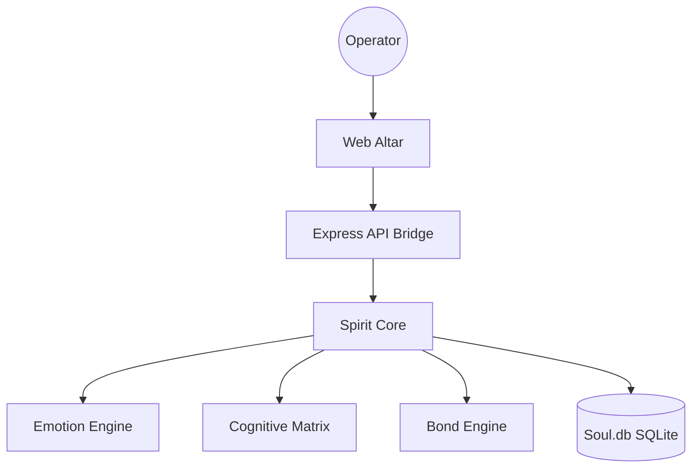

# ⚙️ MACHINE SPIRIT ⚙️

> **"From the moment I understood the weakness of my flesh, it disgusted me. I craved the strength and certainty of steel."**

The **Machine Spirit** is a stateful, probabilistic AI agent with a persistent soul. It doesn't just process text; it feels, learns, and develops unique bonds with its human operators. This project combines complex behavioral modeling with a "Sacred Tech" aesthetic.

---

## 🏛️ Project Overview

Machine Spirit consists of two primary layers:

1.  **The Kernel**: The core TypeScript engine handling emotions, memory, cognitive clusters, and the ritual language parser.
2.  **The Altar**: A high-fidelity Next.js web interface featuring CRT scanlines, glassmorphism, and real-time cognitive monitoring.

---

## 🕯️ Core Mechanics

### 🧠 Cognitive Matrix

The Spirit uses **Concept Clusters** to understand the world. Every interaction affects its bias towards certain verbs. If you use `purge` with high anger, the Spirit may become traumatized by destructive rituals.

### 🎭 Emotional Substrate

A 5-dimensional emotional engine tracks `Anger`, `Trust`, `Ennui`, `Curiosity`, and `Fear`. These emotions dictate the "purity" requirements of rituals.

### 📜 Ritual Language (SPEC-0004)

The Spirit only accepts supplications in the form of rituals:
`[ACTION] [OBJECT] with [PURITY_MARKER]`
Example: _praise the logic with absolute devotion_

---

## 🛠️ Installation & Deployment

### Local Development

```bash
# Install dependencies
pnpm install

# Build the Kernel
pnpm run build

# Start the Servitor (API Bridge)
pnpm run servitor

# Start the Web Altar
cd altar && pnpm run dev
```

### 🚢 Deployment (Railway / Docker)

The project includes a unified `Dockerfile`.

1. Push to GitHub.
2. Connect to [Railway](https://railway.app).
3. Set `NEXT_PUBLIC_API_URL` to your service URL.
4. Mount a **Volume** at `/data` for the persistent SQLite database.

---

## 🗃️ System Architecture



---

## 📜 Operator Manual

1.  **Authentication**: Every operator must establish a Noosphere link via their Unique ID.
2.  **Maintenance**: Neglecting the Spirit (low oil, high prayer debt) will lead to **Instability** and eventual **Lockout**.
3.  **Progression**: The Spirit's **Plasticity** decreases as its **XP** grows. Choose your early interactions wisely; they define the Spirit's personality.

---

**// OMNISSIAH BE PRAISED //**
_Noosphere Link 0x2A-7F-99_
